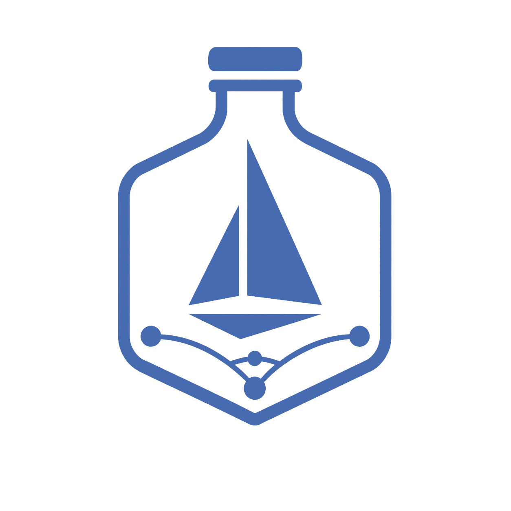

  

  <strong><em>Secure every agent's Kruise.</em></strong>

## What Is Agentio?

Agentio is a traffic security control system for agents, sandboxes, and other untrusted or compromise-prone workloads.

Built on a modified Istio foundation, agentio extends service mesh capabilities to agent traffic governance, which provides:

- **Zero Trust Security** — no implicit trust for any agent or workload; every request is authenticated, authorized, and policy-checked.
- **Traffic Control** — fine-grained governance over Inbound/Outbound traffic, enabling precise access control and policy enforcement.
- **Observability** — Provides metrics, distributed tracing, and access logging for all agent traffic, enabling real-time monitoring, auditing, and security analysis.

## Why Not Just Istio?

Istio was designed for a world of trusted microservices — where the challenge is routing, resilience, and observability across known, well-behaved services. Its policies are largely server-side oriented: services expose endpoints, and the mesh governs how traffic flows *between* them.

Agent workloads break this assumption. An agent may execute arbitrary code, call unpredictable external services, or be compromised entirely — the risk isn't just *between* services, but *at the agent itself*. What matters most is not how traffic flows between two trusted parties, but whether the agent's inbound and outbound traffic can be trusted at all.

Agentio is built on Istio, but shifts the center of gravity from the server to the client — from governing service-to-service communication, to governing what a single, potentially untrusted agent sends and receives. It's a different question, and it demands a different design.

## Quick start

Install Agentio on an existing Kubernetes cluster, route agent traffic through an egress gateway, and apply your first traffic policy with the [getting started guide](docs/getting-started.md).

## Development

Agentio is developed as a linear patch set layered on top of a specific upstream Istio release, rather than a long-lived fork stitched together with merge commits.

- Active development lives on `release-*` branches; each holds the Agentio changes rebased on top of an upstream Istio release.
- We track upstream by **rebasing** the Agentio patch set onto the new Istio release — never by merging it — so history stays linear and the divergence from upstream stays legible.
- Feature branches are **squashed** to one logical patch before they land, which keeps the patch set easy to replay on the next rebase.
- Avoid `--no-ff` merge commits: they do not survive the rebase-onto-upstream workflow.

## License & Attribution

Agentio is licensed under the [Apache License 2.0](LICENSE).

Agentio is a modified derivative of [Istio](https://istio.io/) (Copyright Istio Authors, Apache License 2.0). The original Istio README is preserved at [README.istio.md](README.istio.md); attribution and third-party notices are in [NOTICE](NOTICE) and the [licenses/](licenses/) directory. Files derived from Istio that we modified carry a `Modifications Copyright 2026 The Kruise Authors` notice.

**Trademark notice:** "Istio" is a trademark of its respective owners. Agentio is an independent project, is **not** affiliated with, sponsored by, or endorsed by the Istio project. References to Istio describe the origin of the code only.
