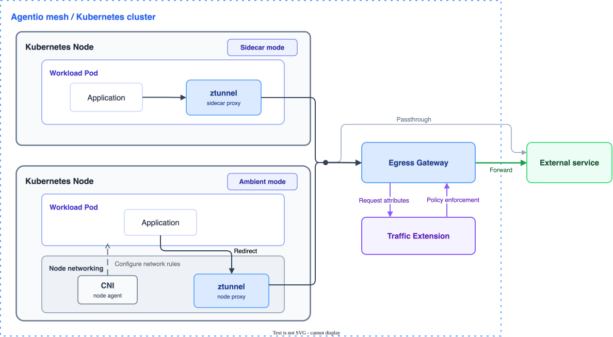

# Getting started

This guide helps you evaluate Agentio on an existing Kubernetes cluster. Start by choosing how Agentio captures workload traffic, then follow the shared egress gateway and `TrafficPolicy` tasks.

Review the chart values and security requirements before you use the evaluation configuration in production.

## Architecture overview

Agentio supports sidecar and ambient traffic capture. The primary path routes egress traffic through the egress gateway, which calls Traffic Extension for policy enforcement. Traffic that does not require gateway enforcement can use the passthrough path to reach the external service directly.

## Choose a data plane mode

Choose one data plane mode for the workloads in an evaluation namespace:

- [Sidecar mode](getting-started/sidecar-mode.md) injects a sidecar proxy into each selected workload Pod. Use it when per-Pod proxy injection fits your workload model.
- [Ambient mode](getting-started/ambient-mode.md) deploys node-level CNI and ztunnel components and captures traffic for selected workloads without adding a proxy container to each Pod.

Sidecar and ambient mode are independently configurable. Evaluate them in separate namespaces and do not enable both paths for the same workload.

## Choose a sidecar onboarding method

If you choose sidecar mode, select the integration that creates your workload:

- Use [Kubernetes admission injection](getting-started/sidecar-mode.md) for ordinary Pods and controllers such as Deployments.
- Use the [OpenKruise Agents integration](integrations/openkruise-agents.md) for `Sandbox` and `SandboxSet` workloads that declare the `traffic-proxy` runtime.

The OpenKruise Agents integration is a sidecar onboarding method, not a third Agentio data plane mode.

## Follow the Agentio workflow

After the workload is enrolled, follow the same Agentio workflow for every onboarding path:

1. [Route traffic through an egress gateway](tasks/route-traffic-through-egress-gateway.md).
2. [Apply a `TrafficPolicy`](tasks/configure-traffic-policy.md).

## See also

- [Sidecar mode](getting-started/sidecar-mode.md)
- [Ambient mode](getting-started/ambient-mode.md)
