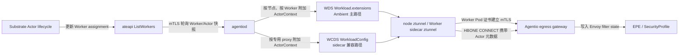
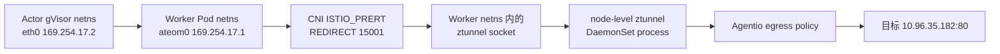

# 基于 Worker mTLS 承载 Actor 身份的 PoC

本文记录 Agentio、ztunnel 与 Substrate 单 Actor Worker 模型的身份适配方案、配置方式、验证方法和本次 KinD 实测结果。

对应英文文档：[Actor identity over Worker mTLS PoC](actor-identity-worker-mtls-poc.md)。

## 1. 目标与结论

本 PoC 的目标是在不为每个 Actor 单独签发 mTLS 证书的前提下，实现 Actor 级别的出向流量识别与策略管控。

最终方案采用两层身份：

1. ztunnel 到 egress gateway 的 HBONE 连接继续使用 Worker Pod 证书建立 mTLS，Worker Pod 身份是传输层身份。
2. `agentiod` 将当前 Worker 绑定的 Actor 身份附加到该 Worker 的 xDS 数据：Ambient 使用 WDS `Workload.extensions`，原 sidecar 模式继续兼容 WCDS `WorkloadConfig.actor_context`。ztunnel 再把 Actor UID、generation、labels 和可选 token 放入 HBONE CONNECT 请求。

验证结果表明该方案可行：

- 不需要为每个 Actor 签发独立的 SPIFFE/mTLS 证书。
- `agentiod` 可以直接从社区 Substrate `ListWorkers` 获取 Worker/Actor assignment，不需要在 Actor 更新时修改 Worker Pod labels。
- ListWorkers 使用 `worker_pod_uid` 与 Kubernetes Pod UID 做精确匹配，同名 Pod 重建后不会继承旧 Actor 身份。
- ActorContext 只下发给对应 Worker，不会泄漏到其他 Worker。
- Ambient node ztunnel 可以从源 Worker 的 `Workload` 取得 ActorContext；Actor UID 或 generation 变化时，只关闭属于该 Worker 的旧连接，不影响同节点其他 Worker。
- Gateway/EPE 可以同时看到经过 mTLS 认证的 Worker Pod 身份和 Actor 身份元数据。
- 现有 `SecurityProfile` 标签选择器可以直接匹配 Actor labels。
- ListWorkers 未启用时，旧 Sandbox/Worker 仍可使用原有 Worker labels，保持向后兼容；启用后 ListWorkers 是权威来源。
- Substrate Actor 通过 `ateom0` 发送的流量可以由原生 Ambient CNI 重定向到 Worker netns 内的 ztunnel socket，并执行 Agentio egress policy。
- 在真实 Ambient Actor 请求中，egress gateway 已收到正确的 Actor UID；Actor suspend/resume 后 generation 从 `2` 更新为 `4`，后续请求携带新 generation。

本方案当前面向“一个 Worker Pod 同时只运行一个 Actor”的模型。一个网络命名空间内并发运行多个 Actor 不在本 PoC 范围内。

需要注意身份粒度：Ambient node ztunnel 仍把源 workload 识别为 Kubernetes Worker Pod，ActorContext 是这个 Worker workload 的扩展属性。因此它适用于社区当前“一个 Worker 同时绑定一个 Actor”的模型；如果未来一个 Worker 网络命名空间内并发多个 Actor，仅靠 `Workload.extensions` 无法区分同一 Worker 中的不同 flow。

## 2. 架构与数据流



请求链路中的身份含义如下：

| 层次 | 身份 | 用途 |
| --- | --- | --- |
| mTLS 传输层 | Worker Pod SPIFFE/ServiceAccount | 认证发起 HBONE 连接的 Worker |
| Actor 元数据层 | Actor UID、generation、labels、token | Actor 级策略选择、审计和身份补充证明 |

Actor 元数据的信任基础是：

- `agentiod` 使用自身 PodIdentity 证书通过 mTLS 调用 Substrate ateapi。
- `agentiod` 用 ListWorkers 返回的 Worker Pod UID 校验当前 Kubernetes workload，再派生 ActorContext。
- Ambient 下，ActorContext 作为 typed extension 附加到目标 Worker 的 `istio.workload.Workload.extensions`，只发送给该 Worker 所在节点的 ztunnel；sidecar 下继续通过 per-proxy WCDS 下发。
- Actor 元数据在已经通过 Worker mTLS 认证的 HBONE 连接内传输。

本 PoC 没有给 Actor 分配可独立验证的 SPIFFE 身份。如果需要 Actor 自身的密码学证明，可以由 Actor runtime 提供签名 token，并在 EPE 中验证。

## 3. Actor 绑定数据源

### 3.1 正式路径：Substrate ListWorkers

推荐配置 `agentiod` 直接调用社区 Substrate 的 `ateapi.Control/ListWorkers`：

```yaml
agentiod:
  substrateListWorkers:
    enabled: true
    address: dns:///api.ate-system.svc:443
    serverName: api.ate-system.svc
    pollInterval: 2s
    rpcTimeout: 5s
    pageSize: 1000
    clientSignerName: podidentity.podcert.ate.dev/identity
    serverTrustSignerName: servicedns.podcert.ate.dev/identity
```

Helm 会给 agentiod 投影 PodIdentity credential bundle 和 ServiceDNS ClusterTrustBundle。数据映射如下：

| ListWorkers 字段 | ActorContext 用途 |
| --- | --- |
| `worker_namespace`、`worker_pod`、`worker_pod_uid` | 精确定位当前 Worker Pod，防止同名 Pod 重建后继承旧绑定 |
| `assignment.actor_uid` | Actor UID |
| `assignment.actor.atespace`、`assignment.actor.name` | Actor 逻辑空间和名称 |
| Worker `version` / `metadata.version` | ActorContext generation；assignment 变化时递增 |
| `assignment.actor_template` | 标准 ActorTemplate labels |
| `worker_pool` | 标准 WorkerPool label |

生成的标准 labels 包括：

```text
agentio.io/actor-uid
agentio.io/actor-name
agentio.io/atespace
agentio.io/actor-generation
agentio.io/actor-template-namespace
agentio.io/actor-template-name
agentio.io/worker-pool
```

ListWorkers 启用后是权威来源：Worker 没有 assignment 时，agentiod 明确不下发 ActorContext；轮询临时失败时保留最后一次成功快照，不会回退到可能过期或可被 workload 修改的 Pod Actor labels。

社区 API 没有 Worker watch RPC，因此当前使用轮询。PoC 同时兼容两种已经公开过但 wire 不兼容的 Worker schema：集群使用的 `2b3a4715` 扁平字段版本，以及当前社区 HEAD 的 `ResourceMetadata`/`WorkerStatus` 版本。

### 3.2 兼容路径：Worker Pod labels

只有在 ListWorkers 未启用时，agentiod 才保留原 PoC 的 Pod label 解析路径。该路径要求 Actor UID、name、atespace 和非零 generation 完整存在，`actor.networking.agents.kruise.io/` 前缀可携带自定义 Actor labels。

正式 Substrate ListWorkers assignment 当前不包含 Actor 自定义 labels。若策略需要 `role=reader` 等自定义属性，应后续增加 `GetActor/ListActors` 补充查询、Actor token claims，或由社区 API 扩展；不能把 workload 自行设置的 Pod label 当作 ListWorkers 模式下的可信 Actor 属性。

## 4. agentiod 与 xDS 行为

`agentiod` 的 PoC 改造包括：

- 在 Agentio `WorkloadConfig` protobuf 中增加 `ActorContext`。
- 通过 mTLS 分页轮询 ListWorkers，并保存完整成功快照。
- 使用 Kubernetes 原生 Pod UID 校验 assignment；轮询失败时保留最后成功快照。
- ListWorkers 快照变化时计算精确的 Worker key；新增、更新和删除都会把对应 workload resource name 放入 `PushRequest.AddressesUpdated`，触发 WDS 增量更新。
- Ambient node ztunnel 只收到本节点 Worker 的 ActorContext；专用 sidecar ztunnel 只收到自己的 ActorContext。
- 在每个 proxy 的发送路径中 clone `Workload` 或全局 `WorkloadConfig` 后再附加 ActorContext，绝不修改共享缓存对象，避免 Actor 身份泄漏到其他节点或 Worker。
- 未启用 ListWorkers 时才从当前 Worker workload labels 构建兼容 ActorContext。

ActorContext 的 protobuf 结构如下：

```proto
message ActorContext {
  string actor_uid = 1;
  string actor_name = 2;
  string atespace = 3;
  uint64 generation = 4;
  map<string, string> labels = 5;
}
```

Ambient 主路径把相同的 protobuf 包装为 typed extension：

```text
Workload.extensions["actor-context"]
type_url = type.googleapis.com/kruise.networking.extensions.v1.ActorContext
```

extension 中不包含 token。token 始终由 Worker runtime 放到 ztunnel 本地只读目录，避免把凭证写入 xDS 和 admin dump。

sidecar 兼容路径则把它作为新增字段加入 `WorkloadConfig`：

```proto
message WorkloadConfig {
  WorkloadConfigScope scope = 1;
  repeated EgressPolicy egress_policies = 2;
  ActorContext actor_context = 3;
}
```

## 5. ztunnel 行为

ztunnel 收到 WDS/WCDS 后会：

1. 解码 `Workload.extensions["actor-context"]`，并校验 Actor UID、name、atespace 和非零 generation。
2. 把 ActorContext 保存到对应的源 `Workload`；WCDS 中的全局 ActorContext 仅作为旧 sidecar 的兼容值。
3. 对 Actor labels 按 key 排序，以 `key=value`、逗号分隔的格式编码，再进行 Base64 编码。
4. 创建出向 HBONE CONNECT 请求时优先使用源 `Workload.actor_context`，没有时才回退到 WCDS ActorContext。
5. 根据 Actor UID 精确读取 `<actor-uid>.token`，不再从目录中任取第一个 token。
6. Ambient Workload 的 Actor UID、generation 变化或 ActorContext 删除时，仅关闭源 Workload UID 匹配的旧连接；WCDS 全局 ActorContext 变化时保留旧 sidecar 的全量 drain 行为。

只更新 egress policy、但 Actor UID 和 generation 没有变化时，不会误关闭连接。

没有 ActorContext 的 Worker 继续走旧兼容路径：发送原有 workload labels，Actor UID 和 generation 保持为空。ztunnel admin `config_dump` 可以看到每个 Workload 的 ActorContext，但不会暴露 token。

## 6. Actor token 挂载

Actor token 对基于 labels 的策略匹配不是必需项，但当 gateway 需要独立验证 Actor 的签名声明时，建议使用 token。

token 不由 `agentiod` 写入。Actor runtime 或 Worker supervisor 负责把 token 写入 ztunnel 可见的共享卷。

ztunnel 监听环境变量 `SANDBOX_TOKEN_PATH`，默认目录为：

```text
/var/opt/sandbox/agent-token/
```

token 文件名必须严格等于 Actor UID 加 `.token`：

```text
/var/opt/sandbox/agent-token/actor-7b93d.token
```

sidecar 注入模板可以显式配置挂载路径：

```yaml
env:
- name: SANDBOX_TOKEN_PATH
  value: /var/run/agentio/actor-tokens
volumeMounts:
- name: actor-token
  mountPath: /var/run/agentio/actor-tokens
  readOnly: true
```

Worker supervisor 应满足以下要求：

- 原子地发布新 token，避免 ztunnel 读到半写入文件。
- Actor 切换时删除旧 Actor 的 token 文件。
- token 文件名始终使用当前 Actor UID。

当 ActorContext 存在时，ztunnel 只读取当前 Actor UID 对应的文件，目录中的其他 token 不会被用作当前请求身份。

## 7. HBONE 与 Gateway 协议

ztunnel 在出向 HBONE CONNECT 请求中加入以下 headers：

| Header | 内容 |
| --- | --- |
| `x-agentio-sandbox-id` | Actor UID |
| `x-agentio-sandbox-generation` | 十进制 Actor generation |
| `x-agentio-sandbox-labels` | 排序后的 Actor labels 文本的 Base64 编码 |
| `x-agentio-sandbox-token` | 对应 Actor token 文件内容的 Base64 编码；没有 token 时省略 |

Gateway 把这些 headers 转换为 Envoy filter state：

| Filter state | 来源 |
| --- | --- |
| `sandbox.id` | `x-agentio-sandbox-id` |
| `sandbox.generation` | `x-agentio-sandbox-generation` |
| `sandbox.labels` | `x-agentio-sandbox-labels` |
| `sandbox.token` | `x-agentio-sandbox-token` |

EPE 中的身份对象保留两类信息：

- `Peer.Pod`：经过 mTLS 认证的 Worker Pod。
- `Peer.ActorUID`、`Peer.ActorGeneration`、`Peer.Labels`：当前 Actor 身份和 labels。

这意味着 Actor 身份不会替换 Worker mTLS 身份，而是在 Worker 身份之上增加 Actor 级策略上下文。

## 8. Actor 级 SecurityProfile 示例

当 ActorContext 存在时，EPE 的 `Peer.Labels` 使用 Actor labels，因此现有 `SecurityProfile` selector 可以直接匹配 Actor：

```yaml
apiVersion: agents.kruise.io/v1alpha1
kind: SecurityProfile
metadata:
  name: actor-reader
  namespace: worker-namespace
spec:
  selector:
    matchLabels:
      role: reader
      agentio.io/atespace: tenant-a
  rules:
  - name: block-example
    match:
    - domains:
      - www.example.com
      methods:
      - POST
    actions:
      block:
        statusCode: 403
        body: actor request blocked
```

需要注意：

- namespaced `SecurityProfile` 仍然按 Worker Pod 所在的 Kubernetes namespace 查找。
- `actor-atespace` 只是 Actor label，不会覆盖 Worker 的 Kubernetes namespace。
- 如果多个 Worker namespace 中的 Actor 需要共享同一策略，应使用 `GlobalSecurityProfile`。

## 9. Actor 切换顺序

ListWorkers 模式下不需要、也不应该由 Agent runtime 修改 Worker Pod labels。Worker 从旧 Actor 切换到新 Actor 时，状态链路如下：

1. Substrate 停止旧 Actor，并清除旧 Worker assignment。
2. `ListWorkers` 返回 Worker 未分配状态；`agentiod` 在下一次成功轮询后更新对应 Worker 的 xDS 资源。Ambient WDS Workload 不再带 ActorContext，sidecar WCDS 则回到空 ActorContext。
3. ztunnel 发现 Actor 绑定从旧值变为 `None`，立即 drain 该 Worker 的旧连接。
4. Substrate 把新 Actor 分配给 Worker，并递增 Worker version。
5. `agentiod` 获取新 assignment，使用 Worker namespace、Pod name 和 Pod UID 精确匹配 Worker，再通过 WDS 或 WCDS 下发新 ActorContext。
6. ztunnel 发现新的 Actor UID/generation，后续连接携带新 Actor 元数据。

如果部署了可选 Actor token，应由 runtime 在新 assignment 生效前原子发布新 token，并在旧 Actor 停止后删除旧 token。Pod label 操作只属于 3.2 节的兼容模式。

## 10. 单元与回归测试

Agentio 聚焦测试：

```console
$ go test ./pilot/pkg/serviceregistry/kube/controller/agentio/... \
    ./pilot/pkg/serviceregistry/kube/controller/ambient \
    ./pilot/pkg/bootstrap -count=1
$ go test ./pilot/pkg/xds \
    -run 'TestWorkloadConfigNeedsPush|TestXdsCache' -count=1
```

EPE 全包测试：

```console
$ go test ./extensions/epe/pkg/... -count=1
```

ztunnel Actor 聚焦测试：

```console
$ cargo test --lib workload_decodes_embedded_actor_context
$ cargo test --lib workload_actor_context_is_visible_in_admin_dump
$ cargo test --lib actor_context_headers_select_matching_token
$ cargo test --lib test_policy_watcher_closes_connections_on_actor_generation_change
$ cargo test --lib test_policy_watcher_closes_only_connections_for_updated_workload_actor
```

为避免并行测试耗尽本机文件描述符，ztunnel lib 回归使用单线程执行；ActorContext 聚焦测试全部通过，排除一个与本改动无关的 Darwin TLS socket 用例后，344 个测试通过：

```console
$ PROTOC=/tmp/agentio-protoc-29.3/bin/protoc \
    cargo test --lib -- --test-threads=1 \
    --skip tls::certificate::test::multi_root
```

被排除的 `tls::certificate::test::multi_root` 在 macOS 25.6 上稳定报 `Connection reset by peer`：测试服务端写入 4 字节后没有发送 TLS `close_notify` 就结束，同时客户端还有未读数据；这是平台相关的既有测试行为，不经过本次修改的 ActorContext、WDS 或连接 drain 路径。

## 11. substrate-poc KinD 实测记录

验证时间：2026-08-15（sidecar/WCDS）、2026-08-17（Ambient）及 2026-08-21（ListWorkers）。

验证集群：`my-ecs` 上的 `substrate-poc` KinD 集群。

使用镜像：

```text
localhost:5000/pilot:actor-context-poc
localhost:5000/ztunnel:actor-context-poc
```

集群中的 `agentiod` 和两个 `ate-demo-egress` Worker sidecar 均成功滚动到 PoC 镜像并保持 Ready。

### 11.1 per-Worker ActorContext 隔离

给第一个 Worker 设置：

```text
actor UID: actor-poc-001
actor name: crawler
atespace: tenant-a
generation: 7
role: reader
team: search
```

该 Worker 的 ztunnel admin `config_dump` 中出现了对应的 WCDS ActorContext：

```json
{
  "actor_context": {
    "actorName": "crawler",
    "actorUid": "actor-poc-001",
    "atespace": "tenant-a",
    "generation": 7,
    "labels": {
      "agentio.io/actor-generation": "7",
      "agentio.io/actor-name": "crawler",
      "agentio.io/actor-uid": "actor-poc-001",
      "agentio.io/atespace": "tenant-a",
      "role": "reader",
      "team": "search"
    }
  }
}
```

第二个 Worker 的 WCDS 中没有 ActorContext，证明 per-proxy 生成没有污染共享的全局 WorkloadConfig。

### 11.2 generation fencing

只把第一个 Worker 的 generation 从 7 更新到 8 后：

- ztunnel 实时 `config_dump` 更新为 generation 8。
- 第二个 Worker 仍然没有 ActorContext。
- ztunnel 记录了预期的连接关闭事件：

```text
previous_actor_binding=Some(("actor-poc-001", 7))
next_actor_binding=Some(("actor-poc-001", 8))
all connections closed because the actor binding changed
```

这验证了同一 Actor UID 重新分配、但 generation 变化时，旧连接不会继续携带旧代次身份。

### 11.3 token 验证边界

本次集群中的 Worker 没有挂载 Actor token 目录，因此 ztunnel 日志会提示 token watcher 无法监听默认目录。该问题不影响 WCDS ActorContext、Actor headers 或 generation fencing。

token 精确选择通过 ztunnel 单元测试验证：测试目录同时放置 `actor-a.token` 和 `actor-b.token`，WCDS 指定 `actor-b` 后，HBONE 请求只携带 `actor-b.token` 的内容。

本次集群实测覆盖了 WCDS 定向下发、per-Worker 隔离和 generation drain；HBONE Actor headers、token 精确选择及 EPE Actor 字段通过聚焦测试覆盖。集群当前使用 passthrough egress policy，未在本次运行中执行真实的 Actor SecurityProfile 拦截决策。

### 11.4 Ambient 模式 Actor 流量捕获与 egress policy

2026-08-17 在同一个 `substrate-poc` KinD 集群重新验证了原生 Ambient 模式。结论是 Ambient 可以捕获从 Actor 内部网络命名空间进入 Worker Pod 的流量；此前 PoC 失败是因为手工尝试了跨 netns DNAT/TPROXY，没有启用 Agentio CNI 已有的虚拟接口重定向能力，并不是因为 ztunnel 无法在 Worker Pod netns 内建立 socket。

#### 11.4.1 Ambient Worker 配置

验证用 Worker 不注入 sidecar，只加入 Ambient 数据面，并显式声明 Substrate 创建的虚拟网卡：

```yaml
metadata:
  labels:
    istio.io/dataplane-mode: ambient
  annotations:
    sidecar.istio.io/inject: "false"
    istio.io/reroute-virtual-interfaces: ateom0
    ambient.istio.io/dns-capture: "false"
```

`istio.io/reroute-virtual-interfaces=ateom0` 是这条链路的关键配置。Actor 恢复后，Substrate 在 Worker Pod netns 和 Actor gVisor netns 之间建立 veth：

```text
Worker Pod netns: ateom0 169.254.17.1/30
Actor gVisor netns: eth0 169.254.17.2/30
```

Actor 的默认路由指向 `169.254.17.1`，因此 Actor egress 首先从 Worker 一侧的 `ateom0` 进入 Worker Pod netns。

#### 11.4.2 ztunnel socket 与重定向规则

ztunnel 进程仍运行在 node-level DaemonSet 中。Agentio CNI node agent 通过 ZDS 把 Worker Pod 的 netns FD 交给 ztunnel；ztunnel 进入该 netns 并创建监听 socket。实测 Worker Pod netns 内的 listener 为：

```text
*:15001  ztunnel outbound
*:15006  ztunnel inbound plaintext
*:15008  ztunnel inbound HBONE
```

CNI 在同一个 Worker Pod netns 中生成以下规则：

```text
-A ISTIO_PRERT -i ateom0 -p tcp -j REDIRECT --to-ports 15001
-A ISTIO_PRERT -i ateom0 -p tcp -j RETURN
```

所以实际数据路径是：



这也解释了 sidecar 和 Ambient 的差异：sidecar ztunnel 的进程和 socket 都在 Worker Pod 内；Ambient ztunnel 的进程在 DaemonSet Pod 中，但监听 socket 通过 `setns` 建在 Worker Pod netns 内。两种模式最终都在 Worker netns 内接收被重定向的连接。

#### 11.4.3 PASSTHROUGH 正向验证

创建并恢复 Actor 后，从 Actor 发起：

```text
GET http://10.96.35.182:80/ambient-reroute-allow
```

通过 `atenet-router` 调用 Actor 的外层 HTTP 状态码为 `200`，Actor 返回的目标响应同样为 `statusCode: 200`。目标服务观察到：

```text
RemoteAddr: 10.244.1.82:<port>
GET /ambient-reroute-allow HTTP/1.1
Host: 10.96.35.182:80
```

`ISTIO_PRERT` 中 `ateom0 -> 15001` 规则的包计数从 `0` 增加到 `1`，证明业务连接确实经过 Ambient ztunnel，而不是从 Actor/Worker 直接绕过。

连接关闭后，ztunnel 记录了 Actor 内部地址和原始目标：

```text
src.addr=169.254.17.2:<port>
src.workload=egress-ambient-poc
src.namespace=ate-demo-egress
dst.addr=10.96.35.182:80
direction=outbound
```

其中 `src.addr=169.254.17.2` 来自 Actor gVisor netns，但 `src.workload` 仍是 Kubernetes Worker Pod。这是当前 Ambient 身份边界的重要证据。

#### 11.4.4 目标 CIDR DENY 验证

将 Agentio 配置临时改为只拒绝测试目标，其余流量继续 PASSTHROUGH：

```yaml
egressPolicies:
- matchCidrs: ["10.96.35.182/32"]
  matchPorts: ["80"]
  policy: DENY
- policy: PASSTHROUGH
```

为了排除旧 keep-alive 连接复用，使用新的测试 Actor 建立新连接。相同请求返回：

```text
HTTP 502
request failed: Get "http://10.96.35.182:80/ambient-reroute-deny": EOF
```

ztunnel 同时记录：

```text
src.addr=169.254.17.2:<port>
dst.addr=10.96.35.182:80
direction=outbound
error="denied by egress policy, dest: 10.96.35.182:80"
```

对应的 `ateom0` 重定向计数从 `0` 增加到 `1`。这证明拒绝发生在 Ambient ztunnel 的 Agentio egress policy 中，而不是目标服务或 `atenet-router`。

#### 11.4.5 策略恢复验证

把配置恢复为：

```yaml
egressPolicies:
- policy: PASSTHROUGH
```

相同 Actor 再次访问同一目标，外层 HTTP 和目标响应均恢复为 `200`，目标服务看到 Worker Pod IP `10.244.1.84`。`ateom0 -> 15001` 规则计数从 `1` 增加到 `2`。

最终独立复核结果为：

```text
responses=200/502/200
redirect_packets=0/1/2
deny_log=present
helm=deployed
cni=2/2
ztunnel=2/2
egress=2/2
policy=PASSTHROUGH
test_resources=removed
```

#### 11.4.6 过程问题与边界

验证中还发现两个与 Ambient 捕获结论分离的问题：

1. `atenet-router` 运行超过证书有效期后仍使用旧的 projected PodCertificate，Worker 入口 TLS 拒绝该证书。滚动重启 `atenet-router` 后获取新证书，请求恢复。这说明 router/Envoy 的证书热加载或生命周期需要单独验证。
2. 一个已经建立过长连接的 Actor 在 checkpoint 后恢复时，`169.254.17.2:80/readyz` 没有回包并停在 `STATUS_RESUMING`。重建测试 Worker、使用全新 Actor 后恢复成功，随后 DENY 和恢复测试均通过。这更像 Substrate/gVisor checkpoint 网络状态竞态，不是新建 Actor 的 Ambient 捕获失败。

### 11.5 ListWorkers 正式数据源 PoC

2026-08-21 在同一集群完成了不依赖 Worker Actor labels 的端到端验证。服务端是 Substrate 提交 `2b3a4715c6b7af4debe42c32791ae7307f18ca1b`，agentiod 使用提交 `0579375c84` 构建：

```text
localhost:5000/pilot:listworkers-poc-v2
sha256:abc166a4798c6d499e4e17ee6a9803b0dc89cb2b7c09f7ac68268b5b71b26a33
```

Helm release 开启了以下配置：

```yaml
agentiod:
  substrateListWorkers:
    enabled: true
    address: dns:///api.ate-system.svc:443
    serverName: api.ate-system.svc
    pollInterval: 2s
```

两个 `ate-demo-egress/egress` Worker 都没有 `networking.agents.kruise.io/actor-*` labels。使用与集群服务端同版本的 `kubectl-ate` 创建并启动临时 Actor：

```console
$ kubectl-ate --kubeconfig /tmp/agentio-kubeconfig-substrate-poc \
    --atespace agentio-poc create actor listworkers-poc-20260821 \
    --template ate-demo-egress/egress
$ kubectl-ate --kubeconfig /tmp/agentio-kubeconfig-substrate-poc \
    --atespace agentio-poc resume actor listworkers-poc-20260821 --boot
```

Substrate 将它分配给 Worker `egress-65d5c9bc57-rtz8l`，Actor UID 为 `139bfe52-b74d-46be-8edb-0e4eafdc8c8c`，Worker version 为 `2`。约一个轮询周期后，该 Worker sidecar 的 WCDS 出现：

```json
{
  "actor_context": {
    "actorName": "listworkers-poc-20260821",
    "actorUid": "139bfe52-b74d-46be-8edb-0e4eafdc8c8c",
    "atespace": "agentio-poc",
    "generation": 2,
    "labels": {
      "agentio.io/actor-generation": "2",
      "agentio.io/actor-name": "listworkers-poc-20260821",
      "agentio.io/actor-uid": "139bfe52-b74d-46be-8edb-0e4eafdc8c8c",
      "agentio.io/atespace": "agentio-poc",
      "agentio.io/actor-template-namespace": "ate-demo-egress",
      "agentio.io/actor-template-name": "egress",
      "agentio.io/worker-pool": "egress"
    }
  }
}
```

另一个 Worker `egress-65d5c9bc57-76q8k` 的 WCDS 始终没有 ActorContext，证明 ListWorkers 快照仍然按 Worker 精确隔离。

暂停 Actor 后，ListWorkers assignment 被清除，约一个轮询周期后两个 Worker 的 WCDS 都不含 ActorContext。对应 ztunnel 日志记录了两次预期 drain：

```text
None -> Some(("139bfe52-b74d-46be-8edb-0e4eafdc8c8c", 2))
Some(("139bfe52-b74d-46be-8edb-0e4eafdc8c8c", 2)) -> None
all connections closed because the actor binding changed
```

ateapi 审计日志确认调用方 mTLS principal 是：

```text
spiffe://cluster.local/ns/agentio-system/sa/agentiod
```

验证还暴露了一个真实兼容性问题：该集群的旧 Worker protobuf 与社区 HEAD 复用了字段号但类型不同，直接按新 schema 解码会失败。PoC 因此让 `ListWorkersResponse.workers` 保持原始 protobuf bytes，再显式识别旧扁平 schema 和当前 `ResourceMetadata`/`WorkerStatus` schema；回归测试包含旧版本的精确 wire 编码。

测试结束后已暂停并删除临时 Actor，Worker assignment 均为空。集群保留 ListWorkers 集成和 `listworkers-poc-v2` agentiod 镜像，便于后续复测。

11.5 完成时尚未验证 node-level ztunnel 的 ActorContext 和 Ambient HBONE Actor headers；这些项目已由 11.6 的后续实现与实测补齐。Actor selector 驱动的 `SecurityProfile` 和同一个 Worker Pod netns 内多个 Actor 的 per-flow 身份区分仍不在本轮集群验证范围内。

本轮远端证据保存在：

```text
my-ecs:/opt/substrate-poc/agentio-ambient-reroute-poc/evidence/
```

测试结束后已经删除临时 Actor 和独立 Ambient Worker，原 `ate-demo-egress/egress` Deployment 恢复为 2/2，Agentio 配置恢复 PASSTHROUGH；Ambient CNI 和 ztunnel DaemonSet 保持启用，便于后续复测。

### 11.6 Ambient Workload extension 与网关 Actor 身份验证

2026-08-21 在同一集群继续完成 WDS `Workload.extensions` 方案的端到端验证。使用的镜像为：

```text
localhost:5000/pilot:actor-workload-poc-v1
sha256:8e955ce8865bb80fe07ae0c0417ea4abaef69200005b580d21cfb9810dc81624

localhost:5000/ztunnel:actor-workload-poc-v1
sha256:27d7e6dd875fddea2eb17fb84042b1a0705b10ddb1acc3562ed17fac5a828dc3
```

验证 Worker 没有注入 sidecar，也没有写入任何 Actor Pod label：

```yaml
metadata:
  name: egress-ambient-actorctx
  namespace: ate-demo-egress
  annotations:
    istio.io/dataplane-mode: ambient
    sidecar.istio.io/inject: "false"
    istio.io/reroute-virtual-interfaces: ateom0
    ambient.istio.io/dns-capture: "false"
```

Substrate assignment 为：

```text
Worker Pod UID: a7478af9-bd5b-4b83-bfa4-7b9e07ce262d
Worker Pod IP:  10.244.1.204
Actor UID:      88fe47fd-a3a2-4612-8b4e-e70d3201f16d
Actor name:     ambient-actorctx-20260821
Atespace:       agentio-poc
```

Worker 所在节点的 ztunnel admin `config_dump` 中只有该 Worker 出现 ActorContext：

```json
{
  "actorContext": {
    "actorName": "ambient-actorctx-20260821",
    "actorUid": "88fe47fd-a3a2-4612-8b4e-e70d3201f16d",
    "atespace": "agentio-poc",
    "generation": 2,
    "labels": {
      "agentio.io/actor-generation": "2",
      "agentio.io/actor-template-name": "egress-ambient-actorctx",
      "agentio.io/actor-template-namespace": "ate-demo-egress",
      "agentio.io/worker-pool": "ambient-actorctx-poc"
    }
  },
  "name": "egress-ambient-actorctx",
  "namespace": "ate-demo-egress",
  "node": "substrate-poc-worker",
  "uid": "substrate-poc//Pod/ate-demo-egress/egress-ambient-actorctx"
}
```

控制平面节点的 ztunnel 中匹配该 Actor UID 的 Workload 数量为 `0`；Worker 节点上其他 Workload 也没有该 ActorContext。这证明 ActorContext 是按 node、按 Worker 装饰 WDS 响应，没有修改共享的基础 Workload 对象。

为验证真实数据路径，把测试目标 `10.96.35.182:80` 临时配置为 `GATEWAY`，其他目标保持 `PASSTHROUGH`：

```yaml
egressPolicies:
- namespaces: [ate-demo-egress]
  matchCidrs: [10.96.35.182/32]
  matchPorts: ["80"]
  policy: GATEWAY
  gateway:
    service: agentio-egress.agentio-system.svc.cluster.local
- policy: PASSTHROUGH
```

Actor 内访问 `/ambient-actorctx-gateway` 返回 `200`，目标服务看到的源 IP 是当时的 Agentio egress gateway Pod `10.244.1.206`，证明连接确实经过网关。网关 access log 同时记录了 Worker 和 Actor 身份：

```json
{
  "actor_generation": "2",
  "actor_uid": "88fe47fd-a3a2-4612-8b4e-e70d3201f16d",
  "path": "/ambient-actorctx-gateway",
  "response_code": 200,
  "sandbox_name": "egress-ambient-actorctx",
  "sandbox_namespace": "ate-demo-egress",
  "upstream_address": "10.96.35.182:80"
}
```

随后暂停 Actor，Worker 的 assignment 被清除，节点 ztunnel 中该 ActorContext 数量收敛为 `0`。再次 boot 后 Actor 回到同一个 Worker，WDS Workload 中的 generation 变为 `4`；真实请求 `/ambient-actorctx-generation-4` 仍返回 `200`，网关日志为：

```json
{
  "actor_generation": "4",
  "actor_uid": "88fe47fd-a3a2-4612-8b4e-e70d3201f16d",
  "path": "/ambient-actorctx-generation-4",
  "response_code": 200,
  "sandbox_name": "egress-ambient-actorctx",
  "sandbox_namespace": "ate-demo-egress"
}
```

这条证据链证明了四件事：

1. `ListWorkers` assignment 变化能触发指定 Worker 的 WDS delta，而不需要更新 Worker Pod label。
2. node ztunnel 根据源 Worker Workload 选择 ActorContext，并通过 Worker mTLS 内的 HBONE headers 传给 gateway。
3. suspend 清除身份、resume 更新 generation，旧代次不会继续用于新连接。
4. 同节点其他 Worker 不会收到或使用该 ActorContext。

验证中另发现一个独立问题：修改 `agentio-config` 的 Ambient egress policy 后，现有 node ztunnel 不会立即刷新已经缓存的 Workload 内嵌策略，因为该全量 push 没有携带 `AddressesUpdated`，WDS generator 会跳过地址增量。重启 ztunnel 后新策略生效。Actor assignment 回调已经显式填充 `AddressesUpdated`，不受这个问题影响；通用的 Ambient egress policy 热更新仍需要单独修复。

测试结束后已暂停并删除临时 Actor、ActorTemplate、Worker Pod 和 WorkerPool；`agentio-config` 已恢复为 `PASSTHROUGH`，临时网关 Actor 日志字段已移除，agentio-egress、agentiod 和两个 ztunnel Pod 均恢复 Ready。

## 12. 代码与分支

Agentio 工作树：

```text
/Users/kuromesi/MyCOde/kuromesi.com/agentio/.worktrees/actor-context-poc
```

Agentio 分支及主要实现提交：

```text
codex/actor-context-poc
6538e7270e agentio: carry actor context over worker mtls
2304c7a9e4 agentio: source actor bindings from substrate
0579375c84 agentio: support legacy substrate worker schema
59806d2da3 agentio: attach actor context to ambient workloads
```

ztunnel 工作树：

```text
/Users/kuromesi/MyCOde/kuromesi.com/ztunnel/.worktrees/actor-context-poc
```

ztunnel 分支及提交：

```text
codex/actor-context-poc
b6acf65 agentio: propagate actor identity over worker mtls
64c1e18 agentio: consume per-workload actor context
```

两个分支均已推送到各自远端，工作树没有未提交的代码变更。

## 13. PoC 限制与后续演进

- 当前只支持一个 Worker 网络命名空间内同时运行一个 Actor。
- Ambient 已经能够通过 `ateom0` 捕获 Actor egress，并把 Actor 绑定建模为源 Worker 的 Workload extension。node ztunnel 是节点共享 proxy，但每条 flow 都会先解析其源 Workload，因此不会把一个 ActorContext 绑定到整个 node ztunnel。
- 多 Actor 并发需要额外的 per-flow Actor 判定机制，例如独立网络命名空间、cgroup/socket cookie、显式本地代理协议或 Actor 专属 listener。
- `actor-atespace` 不会改变 Worker 的 Kubernetes namespace 或 mTLS principal。
- Actor labels 是由可信 Worker ztunnel 携带的 ActorContext 元数据；除非验证签名 token，否则它们不是独立的密码学身份证明。
- ListWorkers 已经消除了 Actor runtime 对 Worker Pod labels 和 generation 的管理要求；runtime 只需在需要独立密码学证明时管理可选 token。
- ListWorkers assignment 当前不包含 Actor 自定义 labels 和完整运行状态；需要按这些属性执行策略时，还要接入 Actor 查询/token claims 或扩展社区 API。
- 当前 API 没有 watch RPC，默认 2 秒轮询意味着 Actor 绑定变更存在一个轮询周期左右的收敛延迟。
- Worker version 可能因非 assignment 更新递增，安全上不会串用旧身份，但会造成一次保守的连接 drain。
- 社区曾发布两种 wire 不兼容的 Worker schema；PoC 已兼容实测旧版本和当前版本，正式维护时仍应推动 API 稳定化并增加版本协商。
- 当前通用 AgentioConfig 变更触发的 Ambient egress policy 全量 push 缺少 address delta；已有 node ztunnel 需要重启才能立即取得新的 Workload 内嵌策略。Actor binding 的增量更新不受影响。
- 如果未来需要零信任级别的 Actor 独立身份，可以在保留 Worker mTLS 的基础上，为 Actor token 增加签名、受众、有效期、Worker UID 和 generation 绑定校验，或者进一步演进到 Actor 独立证书。
