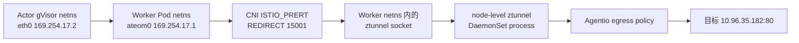

# 基于 Worker mTLS 承载 Actor 身份的 PoC

本文记录 Agentio、ztunnel 与 Substrate 单 Actor Worker 模型的身份适配方案、配置方式、验证方法和本次 KinD 实测结果。

对应英文文档：[Actor identity over Worker mTLS PoC](actor-identity-worker-mtls-poc.md)。

## 1. 目标与结论

本 PoC 的目标是在不为每个 Actor 单独签发 mTLS 证书的前提下，实现 Actor 级别的出向流量识别与策略管控。

最终方案采用两层身份：

1. ztunnel 到 egress gateway 的 HBONE 连接继续使用 Worker Pod 证书建立 mTLS，Worker Pod 身份是传输层身份。
2. `agentiod` 将当前 Worker 绑定的 Actor 身份通过 WCDS 定向下发给该 Worker 的 ztunnel；ztunnel 再把 Actor UID、generation、labels 和可选 token 放入 HBONE CONNECT 请求。

验证结果表明该方案可行：

- 不需要为每个 Actor 签发独立的 SPIFFE/mTLS 证书。
- ActorContext 只下发给对应 Worker，不会泄漏到其他 Worker。
- Actor UID 或 generation 变化时，ztunnel 会主动关闭旧连接，防止 Worker 复用导致身份串用。
- Gateway/EPE 可以同时看到经过 mTLS 认证的 Worker Pod 身份和 Actor 身份元数据。
- 现有 `SecurityProfile` 标签选择器可以直接匹配 Actor labels。
- 没有 ActorContext 的旧 Sandbox/Worker 继续使用原有 Worker labels，保持向后兼容。
- Substrate Actor 通过 `ateom0` 发送的流量可以由原生 Ambient CNI 重定向到 Worker netns 内的 ztunnel socket，并执行 Agentio egress policy。

本方案当前面向“一个 Worker Pod 同时只运行一个 Actor”的模型。一个网络命名空间内并发运行多个 Actor 不在本 PoC 范围内。

需要区分两个已经验证的边界：sidecar 测试验证了 WCDS ActorContext 和 HBONE Actor 元数据；Ambient 测试验证了 Actor 流量捕获、原始目标恢复和 egress policy。当前 node-level ztunnel 仍把源 workload 识别为 Worker Pod，本次 Ambient 测试没有证明共享 node ztunnel 已经能够按 Actor 下发或携带 ActorContext。

## 2. 架构与数据流

```mermaid
flowchart LR
    A["Actor Runtime / Worker Supervisor"]
    K["Worker Pod labels"]
    D["agentiod"]
    Z["Worker Pod 内的 ztunnel sidecar"]
    G["Agentio egress gateway"]
    E["EPE / SecurityProfile"]

    A -->|"更新 Actor UID、generation、labels"| K
    K -->|"Kubernetes workload watch"| D
    D -->|"per-proxy WCDS ActorContext"| Z
    Z -->|"Worker Pod 证书建立 mTLS"| G
    Z -->|"HBONE CONNECT 携带 Actor 元数据"| G
    G -->|"写入 Envoy filter state"| E
```



请求链路中的身份含义如下：

| 层次 | 身份 | 用途 |
| --- | --- | --- |
| mTLS 传输层 | Worker Pod SPIFFE/ServiceAccount | 认证发起 HBONE 连接的 Worker |
| Actor 元数据层 | Actor UID、generation、labels、token | Actor 级策略选择、审计和身份补充证明 |

Actor 元数据的信任基础是：

- `agentiod` 从 Kubernetes 中当前的 Worker workload 派生 ActorContext。
- ActorContext 通过 xDS/WCDS 只发送给目标 Worker 的 ztunnel。
- Actor 元数据在已经通过 Worker mTLS 认证的 HBONE 连接内传输。

本 PoC 没有给 Actor 分配可独立验证的 SPIFFE 身份。如果需要 Actor 自身的密码学证明，可以由 Actor runtime 提供签名 token，并在 EPE 中验证。

## 3. Worker 与 Actor 的标签契约

Actor controller 或 Worker supervisor 通过 Pod labels 将 Actor 绑定到 Worker：

```yaml
metadata:
  labels:
    networking.agents.kruise.io/proxy-type: ztunnel
    networking.agents.kruise.io/actor-uid: actor-7b93d
    networking.agents.kruise.io/actor-name: crawler
    networking.agents.kruise.io/actor-atespace: tenant-a
    networking.agents.kruise.io/actor-generation: "7"
    actor.networking.agents.kruise.io/role: reader
    actor.networking.agents.kruise.io/team: search
```

以下四个字段是完整 ActorContext 的必要字段：

| Pod label | 含义 | 约束 |
| --- | --- | --- |
| `networking.agents.kruise.io/actor-uid` | Actor 唯一标识 | 非空 |
| `networking.agents.kruise.io/actor-name` | Actor 名称 | 非空 |
| `networking.agents.kruise.io/actor-atespace` | Actor 所属逻辑空间 | 非空 |
| `networking.agents.kruise.io/actor-generation` | Worker 绑定代次 | 大于 0 的无符号整数 |

任何必要字段缺失或 generation 非法时，`agentiod` 都不会为该 Worker 下发 ActorContext，ztunnel 也不会发送 Actor 身份头。

前缀为 `actor.networking.agents.kruise.io/` 的 Pod label 会被转换成 Actor label。例如：

```text
actor.networking.agents.kruise.io/role=reader
```

转换后发送给 EPE 的 Actor label 为：

```text
role=reader
```

`agentiod` 还会自动补充以下标准 Actor labels：

```text
agentio.io/actor-uid
agentio.io/actor-name
agentio.io/atespace
agentio.io/actor-generation
```

每次给 Worker 分配 Actor 时都必须递增 generation，即使重新分配的是同一个 Actor UID，也不能复用旧 generation。

## 4. agentiod 与 WCDS 行为

`agentiod` 的 PoC 改造包括：

- 在 Agentio `WorkloadConfig` protobuf 中增加 `ActorContext`。
- 从当前 Worker workload labels 构建 ActorContext，而不是读取 ztunnel 启动时可能已经过期的 bootstrap labels。
- 只给 `networking.agents.kruise.io/proxy-type=ztunnel` 的专用 Worker proxy 附加 ActorContext。
- 复制共享的全局 WorkloadConfig 后再附加 ActorContext，避免修改共享对象并把某个 Actor 泄漏给其他 Worker。
- Worker workload 地址或 labels 变化时，触发该 Worker 的 WCDS 重新生成。

ActorContext 的 protobuf 结构如下：

```proto
message ActorContext {
  string actor_uid = 1;
  string actor_name = 2;
  string atespace = 3;
  uint64 generation = 4;
  map<string, string> labels = 5;
}
```

它作为兼容性新增字段加入 `WorkloadConfig`：

```proto
message WorkloadConfig {
  WorkloadConfigScope scope = 1;
  repeated EgressPolicy egress_policies = 2;
  ActorContext actor_context = 3;
}
```

## 5. ztunnel 行为

ztunnel 收到 WCDS 后会：

1. 校验 Actor UID、name、atespace 和非零 generation。
2. 保存当前 ActorContext。
3. 对 Actor labels 按 key 排序，以 `key=value`、逗号分隔的格式编码，再进行 Base64 编码。
4. 创建出向 HBONE CONNECT 请求时携带 Actor 身份头。
5. 根据 Actor UID 精确读取 `<actor-uid>.token`，不再从目录中任取第一个 token。
6. Actor UID、generation 增加、ActorContext 创建或删除时，关闭当前已跟踪连接。

只更新 egress policy、但 Actor UID 和 generation 没有变化时，不会误关闭连接。

没有 ActorContext 的 Worker 继续走旧兼容路径：发送原有 workload labels，Actor UID 和 generation 保持为空。

## 6. Actor token 挂载

Actor token 对基于 labels 的策略匹配不是必需项，但当 gateway 需要独立验证 Actor 的签名声明时，建议使用 token。

token 不由 `agentiod` 写入。Actor runtime 或 Worker supervisor 负责把 token 写入 ztunnel 可见的共享卷。

ztunnel 监听环境变量 `SANDBOX_TOKEN_PATH`，默认目录为：

```text
/var/opt/sandbox/agent-token/
```

token 文件名必须严格等于 Actor UID 加 `.token`：

```text
/var/opt/sandbox/agent-token/actor-7b93d.token
```

sidecar 注入模板可以显式配置挂载路径：

```yaml
env:
- name: SANDBOX_TOKEN_PATH
  value: /var/run/agentio/actor-tokens
volumeMounts:
- name: actor-token
  mountPath: /var/run/agentio/actor-tokens
  readOnly: true
```

Worker supervisor 应满足以下要求：

- 原子地发布新 token，避免 ztunnel 读到半写入文件。
- Actor 切换时删除旧 Actor 的 token 文件。
- token 文件名始终使用当前 Actor UID。

当 ActorContext 存在时，ztunnel 只读取当前 Actor UID 对应的文件，目录中的其他 token 不会被用作当前请求身份。

## 7. HBONE 与 Gateway 协议

ztunnel 在出向 HBONE CONNECT 请求中加入以下 headers：

| Header | 内容 |
| --- | --- |
| `x-agentio-sandbox-id` | Actor UID |
| `x-agentio-sandbox-generation` | 十进制 Actor generation |
| `x-agentio-sandbox-labels` | 排序后的 Actor labels 文本的 Base64 编码 |
| `x-agentio-sandbox-token` | 对应 Actor token 文件内容的 Base64 编码；没有 token 时省略 |

Gateway 把这些 headers 转换为 Envoy filter state：

| Filter state | 来源 |
| --- | --- |
| `sandbox.id` | `x-agentio-sandbox-id` |
| `sandbox.generation` | `x-agentio-sandbox-generation` |
| `sandbox.labels` | `x-agentio-sandbox-labels` |
| `sandbox.token` | `x-agentio-sandbox-token` |

EPE 中的身份对象保留两类信息：

- `Peer.Pod`：经过 mTLS 认证的 Worker Pod。
- `Peer.ActorUID`、`Peer.ActorGeneration`、`Peer.Labels`：当前 Actor 身份和 labels。

这意味着 Actor 身份不会替换 Worker mTLS 身份，而是在 Worker 身份之上增加 Actor 级策略上下文。

## 8. Actor 级 SecurityProfile 示例

当 ActorContext 存在时，EPE 的 `Peer.Labels` 使用 Actor labels，因此现有 `SecurityProfile` selector 可以直接匹配 Actor：

```yaml
apiVersion: agents.kruise.io/v1alpha1
kind: SecurityProfile
metadata:
  name: actor-reader
  namespace: worker-namespace
spec:
  selector:
    matchLabels:
      role: reader
      agentio.io/atespace: tenant-a
  rules:
  - name: block-example
    match:
    - domains:
      - www.example.com
      methods:
      - POST
    actions:
      block:
        statusCode: 403
        body: actor request blocked
```

需要注意：

- namespaced `SecurityProfile` 仍然按 Worker Pod 所在的 Kubernetes namespace 查找。
- `actor-atespace` 只是 Actor label，不会覆盖 Worker 的 Kubernetes namespace。
- 如果多个 Worker namespace 中的 Actor 需要共享同一策略，应使用 `GlobalSecurityProfile`。

## 9. Actor 切换顺序

Worker 从旧 Actor 切换到新 Actor 时，推荐按照以下顺序操作：

1. 停止旧 Actor 产生新流量，并终止旧 Actor 进程。
2. 原子发布新 Actor token，同时删除旧 token。
3. 在一次 Kubernetes patch 中更新 Actor UID、name、atespace、labels 和递增后的 generation。
4. 等待 `agentiod` 下发新的 WCDS ActorContext。
5. ztunnel 观察到 Actor UID 或 generation 变化后，主动 drain 旧连接。
6. 启动新 Actor 或允许新 Actor 开始发送流量。

设置 Actor 绑定示例：

```console
$ kubectl label pod "$WORKER_POD" -n "$WORKER_NAMESPACE" --overwrite \
    networking.agents.kruise.io/actor-uid=actor-7b93d \
    networking.agents.kruise.io/actor-name=crawler \
    networking.agents.kruise.io/actor-atespace=tenant-a \
    networking.agents.kruise.io/actor-generation=7 \
    actor.networking.agents.kruise.io/role=reader
```

Worker 空闲时删除 Actor 绑定：

```console
$ kubectl label pod "$WORKER_POD" -n "$WORKER_NAMESPACE" \
    networking.agents.kruise.io/actor-uid- \
    networking.agents.kruise.io/actor-name- \
    networking.agents.kruise.io/actor-atespace- \
    networking.agents.kruise.io/actor-generation- \
    actor.networking.agents.kruise.io/role-
```

## 10. 单元与回归测试

Agentio 聚焦测试：

```console
$ go test ./pilot/pkg/serviceregistry/kube/controller/agentio/... \
    ./pilot/pkg/serviceregistry/kube/controller/ambient \
    ./pilot/pkg/xds ./pilot/pkg/xds/filters \
    ./extensions/epe/pkg/extproc/attributes -count=1
```

EPE 全包测试：

```console
$ go test ./extensions/epe/pkg/... -count=1
```

ztunnel Actor 聚焦测试：

```console
$ cargo test --lib actor_context_is_stored_and_replaced_with_workload_config \
    --no-default-features -F tls-boring
$ cargo test --lib actor_context_headers_select_matching_token \
    --no-default-features -F tls-boring
$ cargo test --lib test_policy_watcher_closes_connections_on_actor_generation_change \
    --no-default-features -F tls-boring
```

ztunnel 在 `my-ecs` 上排除需要额外 netns 权限的 `inpod::*` 后，共有 343 个 lib 测试通过：

```console
$ cargo test --lib --no-default-features -F tls-boring -- --skip inpod::
```

完整 `--lib` 测试中与本改动无关的 `inpod` 用例会因为构建容器无权创建 network namespace/link 而报错：

```text
RTNETLINK answers: Operation not permitted
```

## 11. substrate-poc KinD 实测记录

验证时间：2026-08-15（sidecar/WCDS）及 2026-08-17（Ambient）。

验证集群：`my-ecs` 上的 `substrate-poc` KinD 集群。

使用镜像：

```text
localhost:5000/pilot:actor-context-poc
localhost:5000/ztunnel:actor-context-poc
```

集群中的 `agentiod` 和两个 `ate-demo-egress` Worker sidecar 均成功滚动到 PoC 镜像并保持 Ready。

### 11.1 per-Worker ActorContext 隔离

给第一个 Worker 设置：

```text
actor UID: actor-poc-001
actor name: crawler
atespace: tenant-a
generation: 7
role: reader
team: search
```

该 Worker 的 ztunnel admin `config_dump` 中出现了对应的 WCDS ActorContext：

```json
{
  "actor_context": {
    "actorName": "crawler",
    "actorUid": "actor-poc-001",
    "atespace": "tenant-a",
    "generation": 7,
    "labels": {
      "agentio.io/actor-generation": "7",
      "agentio.io/actor-name": "crawler",
      "agentio.io/actor-uid": "actor-poc-001",
      "agentio.io/atespace": "tenant-a",
      "role": "reader",
      "team": "search"
    }
  }
}
```

第二个 Worker 的 WCDS 中没有 ActorContext，证明 per-proxy 生成没有污染共享的全局 WorkloadConfig。

### 11.2 generation fencing

只把第一个 Worker 的 generation 从 7 更新到 8 后：

- ztunnel 实时 `config_dump` 更新为 generation 8。
- 第二个 Worker 仍然没有 ActorContext。
- ztunnel 记录了预期的连接关闭事件：

```text
previous_actor_binding=Some(("actor-poc-001", 7))
next_actor_binding=Some(("actor-poc-001", 8))
all connections closed because the actor binding changed
```

这验证了同一 Actor UID 重新分配、但 generation 变化时，旧连接不会继续携带旧代次身份。

### 11.3 token 验证边界

本次集群中的 Worker 没有挂载 Actor token 目录，因此 ztunnel 日志会提示 token watcher 无法监听默认目录。该问题不影响 WCDS ActorContext、Actor headers 或 generation fencing。

token 精确选择通过 ztunnel 单元测试验证：测试目录同时放置 `actor-a.token` 和 `actor-b.token`，WCDS 指定 `actor-b` 后，HBONE 请求只携带 `actor-b.token` 的内容。

本次集群实测覆盖了 WCDS 定向下发、per-Worker 隔离和 generation drain；HBONE Actor headers、token 精确选择及 EPE Actor 字段通过聚焦测试覆盖。集群当前使用 passthrough egress policy，未在本次运行中执行真实的 Actor SecurityProfile 拦截决策。

### 11.4 Ambient 模式 Actor 流量捕获与 egress policy

2026-08-17 在同一个 `substrate-poc` KinD 集群重新验证了原生 Ambient 模式。结论是 Ambient 可以捕获从 Actor 内部网络命名空间进入 Worker Pod 的流量；此前 PoC 失败是因为手工尝试了跨 netns DNAT/TPROXY，没有启用 Agentio CNI 已有的虚拟接口重定向能力，并不是因为 ztunnel 无法在 Worker Pod netns 内建立 socket。

#### 11.4.1 Ambient Worker 配置

验证用 Worker 不注入 sidecar，只加入 Ambient 数据面，并显式声明 Substrate 创建的虚拟网卡：

```yaml
metadata:
  labels:
    istio.io/dataplane-mode: ambient
  annotations:
    sidecar.istio.io/inject: "false"
    istio.io/reroute-virtual-interfaces: ateom0
    ambient.istio.io/dns-capture: "false"
```

`istio.io/reroute-virtual-interfaces=ateom0` 是这条链路的关键配置。Actor 恢复后，Substrate 在 Worker Pod netns 和 Actor gVisor netns 之间建立 veth：

```text
Worker Pod netns: ateom0 169.254.17.1/30
Actor gVisor netns: eth0 169.254.17.2/30
```

Actor 的默认路由指向 `169.254.17.1`，因此 Actor egress 首先从 Worker 一侧的 `ateom0` 进入 Worker Pod netns。

#### 11.4.2 ztunnel socket 与重定向规则

ztunnel 进程仍运行在 node-level DaemonSet 中。Agentio CNI node agent 通过 ZDS 把 Worker Pod 的 netns FD 交给 ztunnel；ztunnel 进入该 netns 并创建监听 socket。实测 Worker Pod netns 内的 listener 为：

```text
*:15001  ztunnel outbound
*:15006  ztunnel inbound plaintext
*:15008  ztunnel inbound HBONE
```

CNI 在同一个 Worker Pod netns 中生成以下规则：

```text
-A ISTIO_PRERT -i ateom0 -p tcp -j REDIRECT --to-ports 15001
-A ISTIO_PRERT -i ateom0 -p tcp -j RETURN
```

所以实际数据路径是：



这也解释了 sidecar 和 Ambient 的差异：sidecar ztunnel 的进程和 socket 都在 Worker Pod 内；Ambient ztunnel 的进程在 DaemonSet Pod 中，但监听 socket 通过 `setns` 建在 Worker Pod netns 内。两种模式最终都在 Worker netns 内接收被重定向的连接。

#### 11.4.3 PASSTHROUGH 正向验证

创建并恢复 Actor 后，从 Actor 发起：

```text
GET http://10.96.35.182:80/ambient-reroute-allow
```

通过 `atenet-router` 调用 Actor 的外层 HTTP 状态码为 `200`，Actor 返回的目标响应同样为 `statusCode: 200`。目标服务观察到：

```text
RemoteAddr: 10.244.1.82:<port>
GET /ambient-reroute-allow HTTP/1.1
Host: 10.96.35.182:80
```

`ISTIO_PRERT` 中 `ateom0 -> 15001` 规则的包计数从 `0` 增加到 `1`，证明业务连接确实经过 Ambient ztunnel，而不是从 Actor/Worker 直接绕过。

连接关闭后，ztunnel 记录了 Actor 内部地址和原始目标：

```text
src.addr=169.254.17.2:<port>
src.workload=egress-ambient-poc
src.namespace=ate-demo-egress
dst.addr=10.96.35.182:80
direction=outbound
```

其中 `src.addr=169.254.17.2` 来自 Actor gVisor netns，但 `src.workload` 仍是 Kubernetes Worker Pod。这是当前 Ambient 身份边界的重要证据。

#### 11.4.4 目标 CIDR DENY 验证

将 Agentio 配置临时改为只拒绝测试目标，其余流量继续 PASSTHROUGH：

```yaml
egressPolicies:
- matchCidrs: ["10.96.35.182/32"]
  matchPorts: ["80"]
  policy: DENY
- policy: PASSTHROUGH
```

为了排除旧 keep-alive 连接复用，使用新的测试 Actor 建立新连接。相同请求返回：

```text
HTTP 502
request failed: Get "http://10.96.35.182:80/ambient-reroute-deny": EOF
```

ztunnel 同时记录：

```text
src.addr=169.254.17.2:<port>
dst.addr=10.96.35.182:80
direction=outbound
error="denied by egress policy, dest: 10.96.35.182:80"
```

对应的 `ateom0` 重定向计数从 `0` 增加到 `1`。这证明拒绝发生在 Ambient ztunnel 的 Agentio egress policy 中，而不是目标服务或 `atenet-router`。

#### 11.4.5 策略恢复验证

把配置恢复为：

```yaml
egressPolicies:
- policy: PASSTHROUGH
```

相同 Actor 再次访问同一目标，外层 HTTP 和目标响应均恢复为 `200`，目标服务看到 Worker Pod IP `10.244.1.84`。`ateom0 -> 15001` 规则计数从 `1` 增加到 `2`。

最终独立复核结果为：

```text
responses=200/502/200
redirect_packets=0/1/2
deny_log=present
helm=deployed
cni=2/2
ztunnel=2/2
egress=2/2
policy=PASSTHROUGH
test_resources=removed
```

#### 11.4.6 过程问题与边界

验证中还发现两个与 Ambient 捕获结论分离的问题：

1. `atenet-router` 运行超过证书有效期后仍使用旧的 projected PodCertificate，Worker 入口 TLS 拒绝该证书。滚动重启 `atenet-router` 后获取新证书，请求恢复。这说明 router/Envoy 的证书热加载或生命周期需要单独验证。
2. 一个已经建立过长连接的 Actor 在 checkpoint 后恢复时，`169.254.17.2:80/readyz` 没有回包并停在 `STATUS_RESUMING`。重建测试 Worker、使用全新 Actor 后恢复成功，随后 DENY 和恢复测试均通过。这更像 Substrate/gVisor checkpoint 网络状态竞态，不是新建 Actor 的 Ambient 捕获失败。

本轮没有验证以下内容：

- node-level ztunnel 上的 ActorContext 定向下发；
- Ambient HBONE 请求携带 Actor UID、generation、labels 或 token；
- Actor selector 驱动的 `SecurityProfile`；
- 同一个 Worker Pod netns 内多个 Actor 的 per-flow 身份区分。

本轮远端证据保存在：

```text
my-ecs:/opt/substrate-poc/agentio-ambient-reroute-poc/evidence/
```

测试结束后已经删除临时 Actor 和独立 Ambient Worker，原 `ate-demo-egress/egress` Deployment 恢复为 2/2，Agentio 配置恢复 PASSTHROUGH；Ambient CNI 和 ztunnel DaemonSet 保持启用，便于后续复测。

## 12. 代码与分支

Agentio 工作树：

```text
/Users/kuromesi/MyCOde/kuromesi.com/agentio/.worktrees/actor-context-poc
```

Agentio 分支及提交：

```text
codex/actor-context-poc
6538e7270e agentio: carry actor context over worker mtls
b81d7935be docs: record actor context kind validation
```

ztunnel 工作树：

```text
/Users/kuromesi/MyCOde/kuromesi.com/ztunnel/.worktrees/actor-context-poc
```

ztunnel 分支：

```text
codex/actor-context-poc
```

ztunnel 变更已经通过测试并用于构建集群 PoC 镜像，目前保留为该分支上的未提交 diff。

## 13. PoC 限制与后续演进

- 当前只支持一个 Worker 网络命名空间内同时运行一个 Actor。
- Ambient 已经能够通过 `ateom0` 捕获 Actor egress，但 node-level ztunnel 是节点共享 proxy，不能直接复用“每个 sidecar proxy 只有一个 ActorContext”的假设。
- 要在 Ambient 中实现 Actor 级身份，需要把 Actor 绑定建模为按 Worker UID/IP 或虚拟接口定位的 workload 数据，并在接受 `ateom0` 连接时把该映射附加到 flow；不能把一个 ActorContext 直接绑定到整个 node ztunnel。
- 多 Actor 并发需要额外的 per-flow Actor 判定机制，例如独立网络命名空间、cgroup/socket cookie、显式本地代理协议或 Actor 专属 listener。
- `actor-atespace` 不会改变 Worker 的 Kubernetes namespace 或 mTLS principal。
- Actor labels 是由可信 Worker ztunnel 携带的 ActorContext 元数据；除非验证签名 token，否则它们不是独立的密码学身份证明。
- Actor runtime 仍需实现 Worker labels、generation 和 token 的完整生命周期管理。
- 如果未来需要零信任级别的 Actor 独立身份，可以在保留 Worker mTLS 的基础上，为 Actor token 增加签名、受众、有效期、Worker UID 和 generation 绑定校验，或者进一步演进到 Actor 独立证书。
